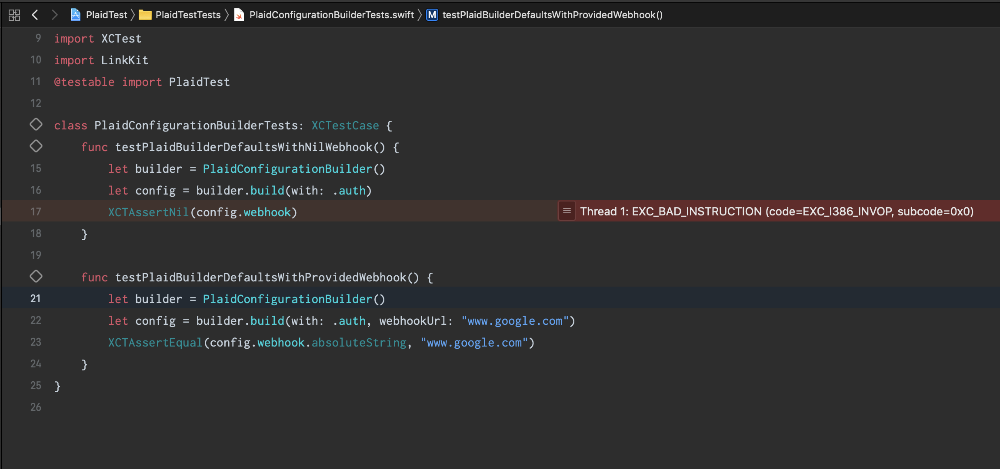

# Plaid Test

## Purpose

This is a project meant to help reproduce a bug with v1.1.13 of the [plaid/link](https://github.com/plaid/link) pod.
The bug has been reported here: https://github.com/plaid/link/issues/284

The files of interest are:
- `PlaidConfigurationBuilder` and
  - This class takes in some parameters and builds a `PLKConfiguration` from them
- `PlaidConfigurationBuilderTests`

In order to reproduce this bug, you'll need to run the unit tests (you can enter `CMD + T` in Xcode to acheive this). Observe that you'll get a `EXC_BAD_ACCESS` call when accessing the `webhook` property of the returned `PLKConfiguration`.
The test in question is `testPlaidBuilderDefaultsWithNilWebhook`:
```swift
func testPlaidBuilderDefaultsWithNilWebhook() {
    let builder = PlaidConfigurationBuilder()
    let config = builder.build(with: .auth)
    XCTAssertNil(config.webhook) // The exception happens here
}
```

The screenshot of the resulting exception in Xcode appears as:



## Requirements

- Xcode 10 or higher

## Setup

Clone this project and then assuming you have Cocoapods installed, you should run this command in your project directory:
```
pod install
```

After you'll need to open up `PlaidTest.xcworkspace` to reproduce this scenario above.
